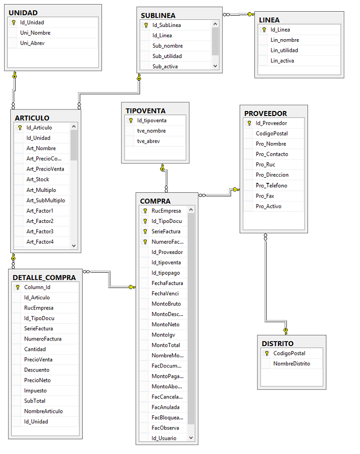

# :maple_leaf::maple_leaf::maple_leaf: POWER BI

## DATAMART
Un Data Mart es un almacén de datos orientado a un área específica, como por ejemplo,  Ventas, Recursos Humanos u otros sectores en una organización. Por ello, también se le conoce como una base de información departamental. 

### DATAMART DE COMPRAS
> Esquema de base de datos:

