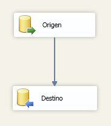

# BUSINESS INTELLIGENCE :maple_leaf::maple_leaf::maple_leaf: POWER BI

## DATAMART
Un Data Mart es un almacén de datos orientado a un área específica, como por ejemplo,  Ventas, Recursos Humanos u otros sectores en una organización. Por ello, también se le conoce como una base de información departamental. 

## DATAMART DE COMPRAS
> Esquema de base de datos:


## TIPO DE TABLA

|TABLA|TIPO|
|---|---|
|ARTICULO|	MAESTRO :blue_book:|
|SUBLINEA|	MAESTRO :blue_book:|
|LINEA|	MAESTRO :blue_book:|
|UNIDAD|	MAESTRO :blue_book:|
|TIPOVENTA|	MAESTRO :blue_book:|
|COMPRA|	TRANSACCIONAL :chart_with_upwards_trend:|
|PROVEEDOR|	MAESTRO :blue_book:|
|DISTRITO|	MAESTRO :blue_book:|
|DETALLECOMPRA|	TRANSACCIONAL :chart_with_upwards_trend:|

##  MODELO DIMENSIONAL
El modelado dimensional se basa en HECHOS (Facts) y es una alternativa al modelado
relacional. Sus principales ventajas son:
- Enfocado en el negocio y sus actividades
- Permite búsquedas a gran velocidad
## Dimension articulo
La dimensión artículo nos brinda información acerca de los artículos más comprados por la empresa se agregó los campos de categoría subcategoría y unidad para hacer una mejor clasificación y ver el comportamiento de los datos.
|dimArticulo|	
|---|
|idArticulo **PK IDENTITY** :key:|
|Id_articulo|
|nombreArticulo|
|categoria|
|subcategoria|
|unidad|
## Dimension proveedor
La dimensión proveedor en el proceso de compras  nos brinda datos de nuestros proveedores agregando el campo distrito para poder clasificarlos, es muy útil esta dimensión para ver el comportamiento de los proveedores .
|dimProveedor|		
|---|
|idProveedor **PK IDENTITY** :key:|	
|Id_Proveedor|
|nomProveedor|
|distritoProveedor|	
## Dimension tipo venta
La dimensión tipo venta nos brinda información  si las compras de la empresa a los proveedores  fueron realizadas al CONTADO, CREDITO, A 15 DIAS, A 30 DIAS, A 21 DIAS o PROFORMA
|dimTipoVenta|
|---|
|idTipoVenta **PK IDENTITY** :key:|
|id_tipoVenta|
|tve_nombre|
## Dimensión tiempo
La dimensión tiempo es muy fundamental pues nos permite saber el comportamiento de los datos por cada periodo de tiempo, y lo podemos clasificar por año, trimestre, mes, quincena.
|dimtiempo|
|---|
|idTiempo **PK IDENTITY** :key:|
|fecha|
|anio|
|nmes|
|nombremes|
|ndia|
|nombredia|
|trimestre|
|quincena|


## Metricas
- Métrica subtotal: La métrica subtotal es el importe esto quiere decir el monto antes de aplicar IGV (impuestos) o descuentos
- Métrica cantidad: La métrica cantidad representa la cantidad de cada compra  por cada transacción. 

|factCompras|
|---|
|idProveedor|
|idArticulo|
|idTipoVenta|
|idTiempo|
|cantidad|
|subtotal|

## Creacion de base de datos multidimencional
Tabla dimArticulo
```sql
create table  dimArticulo(
idArticulo int identity primary key not null ,
Id_articulo char(10) NOT NULL,
nombreArticulo varchar(60) ,
categoria varchar(80),
subcategoria varchar(80),
unidad varchar(30)
)
```
Tabla dimTipoVenta
```sql
create table dimTipoVenta(
idTipoVenta  int identity primary key not null,
id_tipoVenta varchar(100),
tve_nombre  varchar (100)
)
```
Tabla dimTiempo
```sql
create table dimTiempo(
idTiempo int identity primary key not null,
fecha datetime,
anio int,
nmes int,
nombremes varchar(30),
ndia int,
nombredia varchar(30),
trimestre int,
quincena int
)
```
Tabla dimProveedor
```sql
create table dimProveedor(
idProveedor int identity  primary key not null,
Id_Proveedor char(8),
nomProveedor varchar(100),
distritoProveedor varchar(100)
)
```
Tabla factCompras
```sql
CREATE TABLE factCompras(
idProveedor int,
idArticulo int,
idTipoVenta int,
idTiempo int,
cantidad decimal(10,2),
subTotal decimal(10,2)
)
alter table factCompras add constraint fk1 foreign key (idProveedor) references dimProveedor(idProveedor)
alter table factCompras add constraint fk2 foreign key (idArticulo) references dimArticulo(idArticulo)
alter table factCompras add constraint fk3 foreign key (idTipoVenta) references dimTipoVenta(idTipoVenta)
alter table factCompras add constraint fk4 foreign key (idTiempo) references dimTiempo(idTiempo)
```

# CARGA ETL usando SSIS

## Tarea limpiar Tablas


```sql
DELETE FROM dimProveedor
DELETE FROM dimArticulo
DELETE FROM dimTipoVenta
DELETE FROM dimTiempo
DELETE FROM factCompras

DBCC CHECKIDENT (dimProveedor, RESEED, 0)
DBCC CHECKIDENT (dimArticulo, RESEED, 0)
DBCC CHECKIDENT (dimTipoVenta, RESEED, 0)
DBCC CHECKIDENT (dimTiempo, RESEED, 0)
```

## Tarea cargar dimensiones


## Subtareas de cargar dimensiones


## Origen de dimensiones


> Dimension Articulo
```sql
SELECT A.Id_Articulo,a.Art_Nombre as 'nombre',
L.Lin_nombre as 'categoria',SL.Sub_nombre as 'subcategoria',
U.Uni_Nombre as 'unidad'
FROM cowapi..ARTICULO A 
INNER JOIN cowapi..SUBLINEA SL ON SL.Id_SubLinea=A.Id_SubLinea
INNER JOIN cowapi..LINEA L ON L.Id_Linea =SL.Id_Linea
INNER JOIN cowapi..UNIDAD U ON U.Id_Unidad=A.Id_Unidad
```
> Dimension tipo venta
```sql
select Id_tipoventa,tve_nombre from cowapi..TIPOVENTA
```
> Dimension tiempo
```sql
select distinct FechaFactura fecha ,
YEAR(FechaFactura) anio,
MONTH(FechaFactura) mes,
DATENAME(month,FechaFactura) nombremes,
DAY(FechaFactura) dia,
DATENAME(WEEKDAY,FechaFactura) nombredia,
DATEPART(QUARTER,FechaFactura) trimestre,
case when DAY(FechaFactura)<=15 then 1 else 2 end quincena
from cowapi..COMPRA

```
> Dimension proveedor
```sql
select P.Id_Proveedor,P.Pro_Nombre, D.NombreDistrito
from cowapi..PROVEEDOR P
inner join cowapi..DISTRITO D on D.CodigoPostal=P.CodigoPostal
```
## Enlace de dimensiones con origen


## Tarea llenar tabla hechos


## Subtareas de la tarea llenar tabla hechos



> consulta sql para llenar la tabla hechos
```sql
SELECT P.idProveedor,A.idArticulo,TV.idTipoVenta,T.idTiempo,DT.Cantidad,DT.SubTotal FROM
(SELECT Id_Proveedor,Id_Articulo,Id_tipoventa,FechaFactura,Cantidad,SubTotal FROM 
cowapi..COMPRA C 
INNER JOIN cowapi..DETALLE_COMPRA DC ON  (DC.RucEmpresa+'-'+DC.Id_TipoDocu+'-'+DC.SerieFactura+'-'+DC.NumeroFactura)=(C.RucEmpresa+'-'+C.Id_TipoDocu+'-'+C.SerieFactura+'-'+C.NumeroFactura))DT
INNER JOIN dimProveedor P ON P.Id_Proveedor=DT.Id_Proveedor
INNER JOIN dimArticulo A ON A.Id_articulo=DT.Id_Articulo
INNER JOIN dimTipoVenta TV ON TV.id_tipoVenta=DT.Id_tipoventa
INNER JOIN dimTiempo T ON T.fecha=DT.FechaFactura
```
## Ejecucion de tareas


## Power BI dashboard


